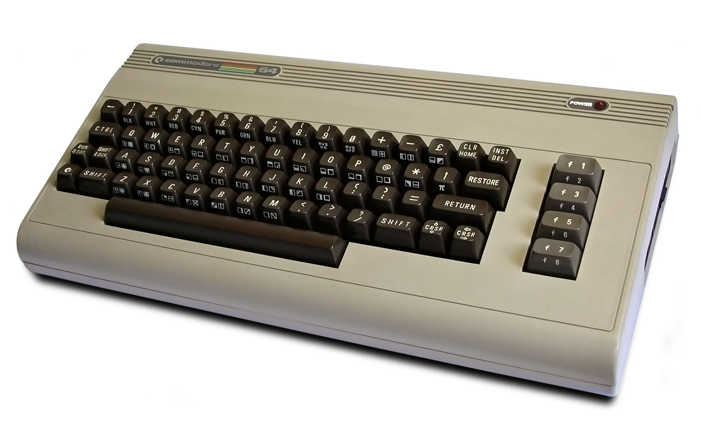
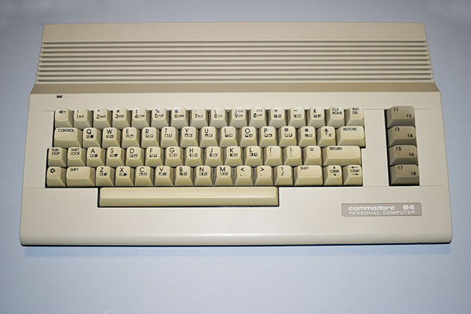

# READY.

# Trail 001 -- La Macchina Commodore 64

## Stage 002 -- Dentro il C64

---

# Informazioni sul Documento

| Proprietà | Valore |
|---|---|
| Documento | Stage 002 -- Dentro il C64 |
| Lingua | Italiano |
| Tipo | Knowledge Trail Stage |
| Trail | Trail 001 -- La Macchina Commodore 64 |
| Stage | 002 |
| Stato | Draft |
| Versione | 0.1.0 |
| Difficoltà | ????? |
| Tempo di studio stimato | 45-60 minuti |
| Prerequisiti | Stage 001 -- Conosciamo la Macchina |

---

# ? Destinazione

Nello Stage 001 abbiamo costruito la nostra prima mappa mentale del Commodore 64.

Ora apriremo quella mappa.

Guarderemo la macchina come oggetto fisico e inizieremo a collegare ciò che abbiamo imparato a livello concettuale con l'hardware reale.

Al termine di questo Stage dovresti essere in grado di:

- distinguere il case del computer dalla motherboard;
- comprendere che cos'è una motherboard;
- riconoscere le principali aree funzionali di una motherboard del C64;
- comprendere che esistono diverse revisioni delle motherboard del C64;
- riconoscere fisicamente la CPU 6510, il VIC-II, il SID, le CIA e la memoria;
- comprendere perché l'identificazione di un chip deve sempre tenere conto della revisione hardware;
- iniziare a leggere una fotografia della motherboard come una mappa tecnica.

**Per questo Stage non è necessario conoscere il linguaggio Assembly.**

---

# ? Cartello del Sentiero -- Apriamo la Macchina

> Il C64 non è il case beige.
>
> Il case è soltanto il suo involucro.
>
> La macchina è dentro.

Fino ad ora abbiamo osservato il C64 dall'esterno.

Ora entriamo al suo interno.

---

# Why Should I Care?

Se hai mai osservato una motherboard del C64, potresti aver avuto la stessa prima reazione:

> "Ci sono davvero un sacco di chip."

È perfettamente normale.

Una fotografia della motherboard può inizialmente sembrare un paesaggio composto da anonimi rettangoli neri, condensatori, resistenze e piste di rame.

Il nostro obiettivo non è memorizzare la posizione di ogni componente.

Il nostro obiettivo è imparare a **leggere il paesaggio**.

Quando riuscirai a guardare una motherboard e chiederti:

> "Qual è il ruolo di questo componente?"

la fotografia smetterà di essere misteriosa.

Diventerà una mappa.

---

# ? Layer 1 -- Intuizione

## Che cos'è una Motherboard?

La motherboard è la scheda elettronica che collega tra loro i principali componenti di un computer.

Pensala come il **terreno sul quale vivono e comunicano gli specialisti della macchina**.

La scheda contiene:

- circuiti integrati;
- chip di memoria;
- connettori;
- resistenze;
- condensatori;
- oscillatori e circuiti di clock;
- circuiti di alimentazione;
- piste di rame;
- e molti altri componenti di supporto.

La CPU non può semplicemente stare sulla scheda e funzionare da sola.

Ha bisogno di collegamenti elettrici con la memoria e con gli altri dispositivi.

Il VIC-II ha bisogno di accedere a informazioni e segnali di temporizzazione.

Il SID ha bisogno di alimentazione, clock e comunicazione con la CPU.

I chip CIA collegano il computer al mondo esterno.

La motherboard è l'infrastruttura fisica che rende possibili tutte queste relazioni.

---

# Il C64 non ha una sola configurazione hardware

Questa è la nostra prima importante avvertenza.

Non esiste una sola motherboard del C64.

Durante la vita commerciale del Commodore 64, Commodore produsse numerose revisioni della motherboard.

I componenti cambiarono posizione.

Cambiarono le versioni dei chip.

Cambiarono i circuiti di alimentazione.

Cambiarono le tecnologie utilizzate per la memoria.

Cambiarono i layout.

Alcune progettazioni successive integrarono le funzioni in modo differente.

Pertanto:

> **Un indirizzo di memoria, il numero di un chip o la sua posizione fisica non devono mai essere interpretati senza considerare la revisione hardware, quando è necessaria una precisione specifica per quella revisione.**

Questo principio diventerà estremamente importante quando studieremo il comportamento dell'hardware.

---

# ? Il C64 dall'esterno

Prima di aprire la macchina, ricordiamo ciò che vedeva realmente l'utente.



*Figura 1 -- La forma originale del Commodore 64, comunemente chiamata "breadbin". Prima della pubblicazione definitiva dovranno essere registrate nei metadati dell'asset le informazioni sulla fonte e sulla licenza.*

Il famoso case originale viene comunemente chiamato **breadbin**, cioè "contenitore del pane", per la sua forma.

È diventato uno dei design di computer più riconoscibili degli anni '80.

Ma il case beige ci dice molto poco su come funzioni realmente il computer.

Per scoprirlo dobbiamo aprirlo.

---

# ? Il successivo C64C



*Figura 2 -- Il successivo design del case Commodore 64C. Prima della pubblicazione definitiva dovranno essere registrate nei metadati dell'asset le informazioni sulla fonte e sulla licenza.*

Il C64C è particolarmente utile per un motivo:

ci ricorda che **lo stesso nome commerciale non significa necessariamente hardware interno identico**.

Proseguendo nella Bible impareremo a distinguere:

- modello;
- revisione della motherboard;
- revisione dei chip;
- sistemi PAL e NTSC;
- e altre varianti hardware.

Questo è fondamentale per un'attività seria di reverse engineering.

---

# ? Layer 2 -- Vista Pratica

## Apriamo il Case

Immagina di rimuovere il gruppo tastiera/case.

Ciò che compare sotto di esso è molto diverso dal simpatico ambiente BASIC che abbiamo visto nello Stage 001.

Non c'è:

```text
READY.